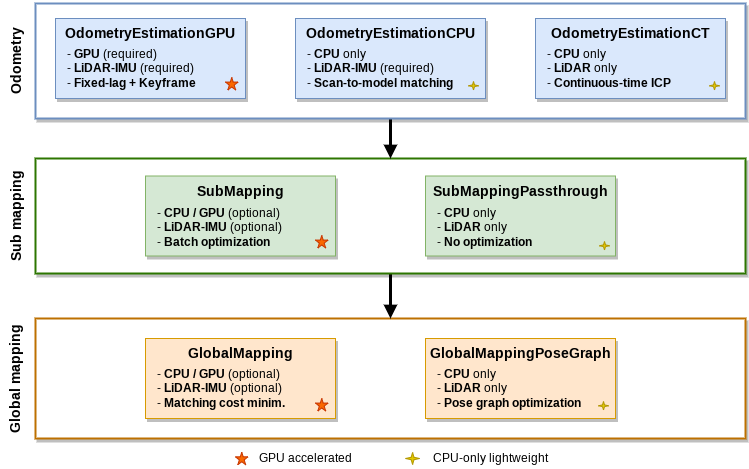

## Introduction

**GLIM** is a versatile and extensible range-based 3D mapping framework.

- ***Accuracy:*** GLIM is based on direct multi-scan registration error minimization on factor graphs that enables to accurately retain the consistency of mapping results. GPU acceleration is supported to maximize the mapping speed and quality.
- ***Easy-to-use:*** GLIM offers an interactive map correction interface that enables the user to manually correct mapping failures and easily refine mapping results.
- ***Versatility:*** As we eliminated sensor-specific processes, GLIM can be applied to any kind of range sensors including:
    - Spinning-type LiDAR (e.g., Velodyne HDL32e)
    - Non-repetitive scan LiDAR (e.g., Livox Avia)
    - Solid-state LiDAR (e.g., Intel Realsense L515)
    - RGB-D camera (e.g., Microsoft Azure Kinect)
- ***Extensibility:*** GLIM provides the global callback slot mechanism that allows to access the internal states of the mapping process and insert additional constraints to the factor graph. We also release [glim_ext](https://github.com/koide3/glim_ext) that offers example implementations of several extension functions (e.g., explicit loop detection, LiDAR-Visual-Inertial odometry estimation).

**Documentation: [https://koide3.github.io/glim/](https://koide3.github.io/glim/)**  
**Docker hub:** [koide3/glim_ros1](https://hub.docker.com/repository/docker/koide3/glim_ros1/tags), [koide3/glim_ros2](https://hub.docker.com/repository/docker/koide3/glim_ros2/tags), [ROS1 on Jetpack 5.1.4](https://hub.docker.com/r/junekyoopark/arm64v8_glim_ros1_cuda12.2) (made by [junekyoopark](https://github.com/junekyoopark))  
**Related packages:** [gtsam_points](https://github.com/koide3/gtsam_points), [glim](https://github.com/koide3/glim), [glim_ros1](https://github.com/koide3/glim_ros1), [glim_ros2](https://github.com/koide3/glim_ros2), [glim_ext](https://github.com/koide3/glim_ext)

Tested on Ubuntu 22.04 /24.04 with CUDA 12.2 / 12.5, and NVIDIA Jetson Orin (Jetpack 6.0).

If you find this package useful for your project, please consider leaving a comment [here](https://github.com/koide3/glim/issues/19). It would help the author receive recognition in his organization and keep working on this project.

[](https://github.com/koide3/glim/actions/workflows/build.yml)
[](https://github.com/koide3/glim_ros1/actions/workflows/build.yml)
[](https://github.com/koide3/glim_ros2/actions/workflows/build.yml)
[](https://github.com/koide3/glim_ext/actions/workflows/build.yml)

## Dependencies
### Mandatory
- [Eigen](https://eigen.tuxfamily.org/index.php)
- [nanoflann](https://github.com/jlblancoc/nanoflann)
- [GTSAM](https://github.com/borglab/gtsam)
- [gtsam_points](https://github.com/koide3/gtsam_points)

### Optional
- [CUDA](https://developer.nvidia.com/cuda-toolkit)
- [OpenCV](https://opencv.org/)
- [OpenMP](https://www.openmp.org/)
- [ROS/ROS2](https://www.ros.org/)
- [Iridescence](https://github.com/koide3/iridescence)

## Gallery

See more at [Video Gallery](https://github.com/koide3/glim/wiki/Video-Gallery).

| Mapping with various range sensors | Outdoor driving test with Livox MID360 |
|---|---|
|[](https://www.youtube.com/watch?v=_fwK4awbW18)|[](https://www.youtube.com/watch?v=CIfRqeV0irE)|

| Manual loop closing | Merging multiple mapping sessions |
|---|---|
|||

## Estimation modules

GLIM provides several estimation modules to cover use scenarios, from robust and accurate mapping with a GPU to lightweight real-time mapping with a low-specification PC like Raspberry Pi.



## Thirdparty works using GLIM

- [kamibukuro5656/MapCleaner_Unofficial](https://github.com/kamibukuro5656/MapCleaner_Unofficial)

## License

If you find this package useful for your project, please consider leaving a comment [here](https://github.com/koide3/glim/issues/19). It would help the author receive recognition in his organization and keep working on this project. Please also cite the following paper if you use this package in your academic work.

This package is released under the MIT license. For commercial support, please contact ```k.koide@aist.go.jp```.

## Related work

Koide et al., "GLIM: 3D Range-Inertial Localization and Mapping with GPU-Accelerated Scan Matching Factors", Robotics and Autonomous Systems, 2024, [[DOI]](https://doi.org/10.1016/j.robot.2024.104750) [[Arxiv]](https://arxiv.org/abs/2407.10344)

The GLIM framework involves ideas expanded from the following papers:  
- (LiDAR-IMU odometry and mapping) "Globally Consistent and Tightly Coupled 3D LiDAR Inertial Mapping", ICRA2022 [[DOI]](https://doi.org/10.1109/ICRA46639.2022.9812385)
- (Global registration error minimization) "Globally Consistent 3D LiDAR Mapping with GPU-accelerated GICP Matching Cost Factors", IEEE RA-L, 2021, [[DOI]](https://doi.org/10.1109/LRA.2021.3113043)
- (GPU-accelerated scan matching) "Voxelized GICP for Fast and Accurate 3D Point Cloud Registration", ICRA2021, [[DOI]](https://doi.org/10.1109/ICRA48506.2021.9560835)

## Contact
[Kenji Koide](https://staff.aist.go.jp/k.koide/), k.koide@aist.go.jp<br>
National Institute of Advanced Industrial Science and Technology (AIST), Japan

